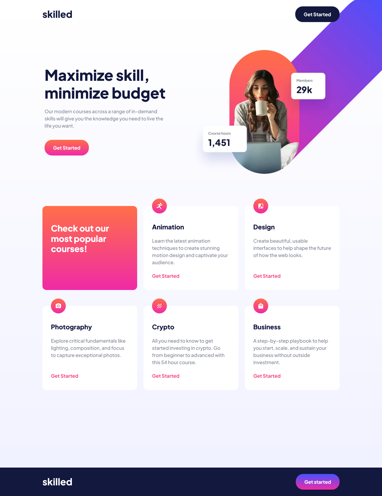

# Frontend Mentor - Skilled e-learning landing page solution

This is a solution to the [Skilled e-learning landing page challenge on Frontend Mentor](https://www.frontendmentor.io/challenges/skilled-elearning-landing-page-S1ObDrZ8q). Frontend Mentor challenges help you improve your coding skills by building realistic projects.

## Table of contents

- [Overview](#overview)
  - [The challenge](#the-challenge)
  - [Screenshot](#screenshot)
  - [Links](#links)
- [My process](#my-process)
  - [Built with](#built-with)
  - [What I learned](#what-i-learned)
  - [Continued development](#continued-development)
  - [Useful resources](#useful-resources)
- [Author](#author)
- [Acknowledgments](#acknowledgments)

## Overview

### The challenge

Users should be able to:

- View the optimal layout depending on their device's screen size
- See hover states for interactive elements

### Screenshot




### Links

- Solution URL: [Solution URL](https://www.frontendmentor.io/solutions/offset-hero-image-mjihKXHXdY)
- Live Site URL: [Live site URL](https://cla91.github.io/skilled-elearning-landing-page/)

## My process

### Built with

- Semantic HTML5 markup
- CSS custom properties
- Flexbox
- CSS Grid
- Mobile-first workflow

### What I learned

here's how I handled the responsive image with `picture` and `srcset` for different screen sizes and Retina displays:

```html
<picture>
  <source
    srcset="
      assets/images/image-hero-desktop.webp    1x,
      assets/images/image-hero-desktop@2x.webp 2x
    "
    media="(min-width: 1024px)"
    type="image/webp"
  />
  <source
    srcset="
      assets/images/image-hero-desktop.png    1x,
      assets/images/image-hero-desktop@2x.png 2x
    "
    media="(min-width: 1024px)"
  />

  <source
    srcset="
      assets/images/image-hero-tablet.webp    1x,
      assets/images/image-hero-tablet@2x.webp 2x
    "
    media="(min-width: 768px) and (max-width: 1023px)"
    type="image/webp"
  />
  <source
    srcset="
      assets/images/image-hero-tablet.png    1x,
      assets/images/image-hero-tablet@2x.png 2x
    "
    media="(min-width: 768px) and (max-width: 1023px)"
  />

  <source
    srcset="
      assets/images/image-hero-mobile.webp    1x,
      assets/images/image-hero-mobile@2x.webp 2x
    "
    media="(max-width: 767px)"
    type="image/webp"
  />
  <source
    srcset="
      assets/images/image-hero-mobile.png    1x,
      assets/images/image-hero-mobile@2x.png 2x
    "
    media="(max-width: 767px)"
  />

  
</picture>
```

### Continued development

In future projects, I want to continue focusing on:

- Refining CSS positioning for complex layouts, especially when elements are designed to break out of the standard flow.

- Exploring more advanced responsive image techniques, possibly including client hints or server-side image optimization.

- Improving the accessibility of interactive elements and semantic structure.

## Author

- Website - [Claudia Cantiani](https://cla91.github.io/)
- Frontend Mentor - [@cla91](https://www.frontendmentor.io/profile/cla91)
- Github - [@cla91](https://github.com/cla91)
